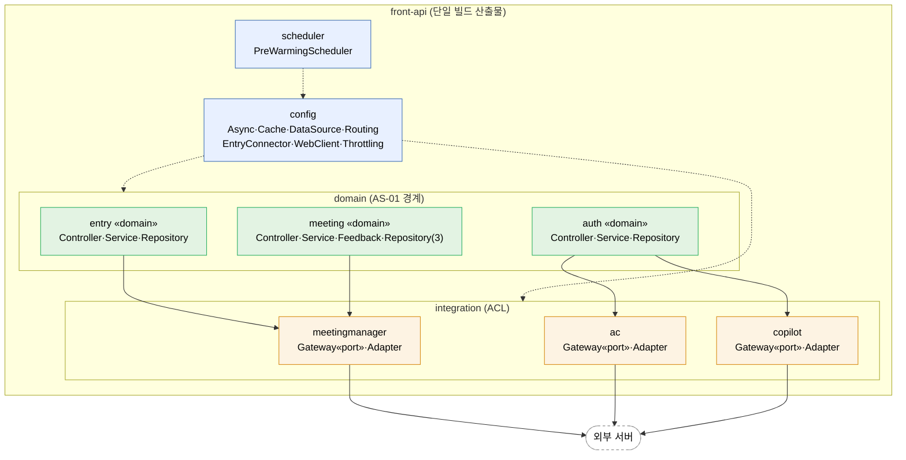

#### 4.2.2. 모듈 뷰 (Module View)

모듈 뷰는 시스템을 구성하는 정적 빌드 단위(소스 코드·패키지·클래스)와 그 의존 관계를 보여준다. 4.2.1 실행 뷰가 런타임 컴포넌트를 다뤘다면, 본 절은 어떤 코드가 어떤 패키지에 속하고 어떻게 결합되어 빌드되는가를 `com.example.frontapi` 실제 구현을 기준으로 다룬다.

> **본 절의 범위**: front-api 애플리케이션 코드(`com.example.frontapi`)에 한정한다. Redis·MariaDB·외부 서버 등은 별도 운영 인프라이며 본 사업의 빌드 산출물이 아니다. 다만 코드 측에서 인프라·외부 서버와 결합하는 Adapter 모듈(`integration.*`)과 설정 모듈(`config.*`)은 본 절에 포함된다.

> **헥사고날 표기 규칙**: 각 도메인은 port·adapter·application 3구조로 기술한다. port(`integration.*.Gateway` 인터페이스)는 도메인이 외부 서버에 요구하는 계약, adapter(`integration.*.Adapter` 구현)는 그 계약을 RestTemplate·Resilience4j로 실현하는 코드, application(`domain.*.Service`)은 도메인 서비스·포트를 조합해 흐름을 완성하는 계층이다. `domain.*` 코드는 외부 서버 SDK나 HTTP 클라이언트를 직접 import 하지 않는다.

**패키지 구조**

```
front-api/  (com.example.frontapi)
  domain/     entry/  auth/  meeting/
  integration/  meetingmanager/  ac/  copilot/
  config/     Async·Cache·DataSource·Routing·EntryConnector·WebClient·Throttling
  scheduler/  PreWarmingScheduler
```

**시스템 모듈 뷰**


<!-- 이미지 파일명(draw.io → PNG 교체 시): report/images/4.2-module-view.png -->
<p align="center"><em>[그림 52] 시스템 모듈 뷰: front-api 패키지 구조와 빌드 의존 (domain→integration Gateway port, AS-01 단방향 경계)</em></p>

> **범례·의존 설명.** 실선은 `domain` → `integration`의 `Gateway`(port) 의존이며, Adapter 구현체 직접 참조는 ArchUnit이 빌드 타임에 차단한다. `integration.*` → 외부 서버 실선은 각 `Adapter`가 RestTemplate + `@CircuitBreaker`로 외부를 호출함을 뜻한다. 점선은 `config`의 Bean 주입과 `scheduler`의 config 사용이다. 본 뷰는 코드 패키지와 빌드 의존만 다루며, 런타임 인프라(캐시·풀·DB)는 실행 뷰(4.2.1)·배치 뷰(4.2.3) 소관이다.

**모듈별 역할**

| 패키지 | 주요 클래스 | 역할 | 관련 AS |
| ----- | ----- | ----- | :---: |
| `domain.entry` | Controller·Service·Repository·EntryRecord | 회의 입장·conference-token 발급(UC-04) | AS-01·04·08 |
| `domain.auth` | Controller·Service·Repository·MemberPermission | 권한 갱신(UC-01), 캐시·CB Fallback | AS-01·03·09 |
| `domain.meeting` | Controller·Service·Feedback·Repository(3)·Meeting·Participant | 회의 시작·조회·종료, cPaaS 피드백, CQRS 분리 | AS-01·07·08 |
| `integration.meetingmanager` · `ac` · `copilot` | Gateway(port)·Adapter | 외부 서버 연계(ACL), 서버별 차등 CB | AS-09·02 |
| `config` | Async·Cache·DataSource·Routing·EntryConnector·WebClient·Throttling | 전략별 인프라 Bean | AS-02·03·04·06·07·08 |
| `scheduler` | PreWarmingScheduler | 예약 회의 기반 L2 선제 적재 | AS-05 |
<p align="center"><em>[표 69] 모듈 뷰 패키지별 역할</em></p>

**의존 방향: 단방향 보장**

- 상위(`domain`) → 하위(`integration.Gateway`·`config` Bean) 단방향. `integration`·`config`는 `domain`에 역의존하지 않는다.
- 도메인 간 직접 호출 없음: `entry`·`auth`·`meeting`은 서로의 Service를 직접 호출하지 않는다.
- ArchUnit 규칙: `domain..`에서 `integration..*Adapter` 참조 시 빌드 실패.

각 패키지의 클래스 구성·상세는 하위 절(4.2.2.1~4.2.2.5)에서 다룬다.
