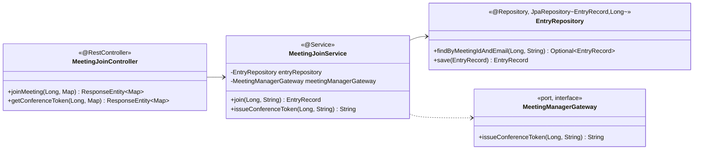

##### 4.2.2.1. domain.entry 모듈

###### 본 절의 범위

입장 처리 도메인의 클래스 구성·결합·핵심 다이어그램을 다룬다. 본 패키지는 UC-04 회의 입장과 conference-token 발급을 단독 책임지며, 요청 집중 구간의 핵심 병목 경로다. 핵심 관심사는 AS-08 join-pool Bulkhead과 AS-04 입장 전용 Connector(8081)로, 입장 처리가 다른 기능과 스레드·커넥션을 다투지 않도록 격리하는 데 있다.

###### 구성

| 클래스 | 스테레오타입 | 책임 | 관련 AS |
| ----- | ----- | ----- | :---: |
| `MeetingJoinController` | @RestController | `/meetings/{id}/join`·`/conference-token` endpoint | AS-04 |
| `MeetingJoinService` | @Service (application) | 입장 가능 확인·`EntryRecord` 저장, conference-token 발급 조립 | AS-01·08 |
| `EntryRepository` | @Repository (JpaRepository) | `EntryRecord` 영속화, join-pool 귀속 | AS-08 |
| `EntryRecord` | entity | 참석자 입장 레코드 | — |
| `MeetingManagerGateway` | port (interface) | 외부 연계 계약(입장 정보·token) | AS-09 |

<em>[표 70] domain.entry 클래스 구성</em>

###### 클래스 다이어그램

<!-- 이미지 파일명(draw.io → PNG 교체 시): report/images/4.2.2-class-entry.png -->

<em>[그림 53] domain.entry 클래스 다이어그램</em>

###### 클래스별 상세

- **`MeetingJoinController`**: 입장·token 요청을 `MeetingJoinService`에 위임한다. Nginx가 이 경로를 8081(입장 전용 Connector)로 라우팅한다(AS-04).
- **`MeetingJoinService`**: `@Transactional` 안에서 입장 가능 여부를 확인하고 셀프 참석자면 `EntryRecord`를 저장한 뒤, `meetingManagerGateway.issueConferenceToken()`으로 외부 입장 정보를 받아 조립한다. 외부 연계는 `Gateway`(port)로만 의존한다(AS-01).
- **`EntryRepository`**: `JpaRepository<EntryRecord, Long>`. write 트랜잭션이라 join-pool(Primary)로 라우팅된다.

###### 핵심 관심사·AS 결합

| 관심사 | 결합 | AS |
| ----- | ----- | :---: |
| 입장 전용 경로 | Nginx 8081 → 전용 Connector(`EntryConnectorConfig`) | AS-04 |
| DB 커넥션 격리 | `EntryRepository` → join-pool | AS-08 |
| 외부 장애 차단 | `MeetingManagerGateway` → Adapter `@CircuitBreaker` | AS-09 |

<em>[표 71] domain.entry 핵심 관심사·AS 결합</em>

###### 타 패키지·외부 의존

`integration.meetingmanager`(`MeetingManagerGateway` port)에만 의존하며, Adapter 구현체 직접 참조는 ArchUnit이 차단한다. `config`의 joinDataSource(AS-08)·EntryConnectorConfig(AS-04) Bean을 주입받는다.
