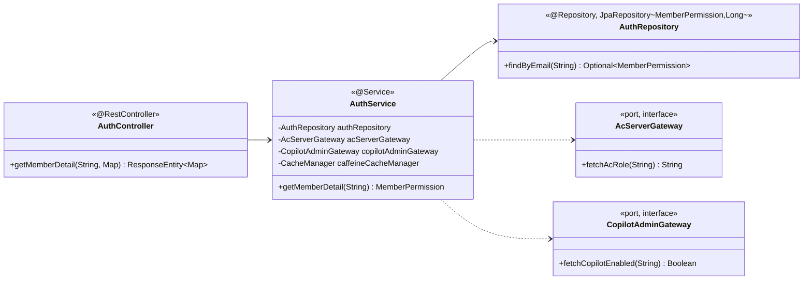

##### 4.2.2.2. domain.auth 모듈

###### 본 절의 범위

권한 갱신 도메인의 클래스 구성·결합을 다룬다. 본 패키지는 UC-01 회원 권한 조회(`GET /members/{email}/detail`)를 책임진다. 핵심 관심사는 AS-03 캐시 완충과 AS-09 계층 폴백으로, 외부 권한 서버(AC·Copilot) 호출을 L1 캐시로 완충하고 장애 시 DB로 폴백해 응답시간(QA-01)을 지키는 데 있다.

###### 구성

| 클래스 | 스테레오타입 | 책임 | 관련 AS |
| ----- | ----- | ----- | :---: |
| `AuthController` | @RestController | `/members/{email}/detail` endpoint | — |
| `AuthService` | @Service (application) | `@Cacheable`(L1) 캐시, AC·Copilot 조회, DB 폴백 | AS-03·09 |
| `AuthRepository` | @Repository (JpaRepository) | `MemberPermission` 조회(폴백값 포함) | AS-08 |
| `MemberPermission` | entity | 회원 권한(AC 역할·Copilot 여부) | — |
| `AcServerGateway` · `CopilotAdminGateway` | port (interface) | 외부 권한 조회 계약 | AS-09 |

<em>[표 72] domain.auth 클래스 구성</em>

###### 클래스 다이어그램

<!-- 이미지 파일명(draw.io → PNG 교체 시): report/images/4.2.2-class-auth.png -->

<em>[그림 54] domain.auth 클래스 다이어그램</em>

###### 클래스별 상세

- **`AuthController`**: 회원 상세 권한 요청을 `AuthService`에 위임한다. 일반 Connector(8080) 경로다.
- **`AuthService`**: `@Cacheable("member-permissions", cacheManager="caffeineCacheManager")`(AS-03 L1)로 반복 조회를 완충한다. miss 시 `acServerGateway.fetchAcRole()`·`copilotAdminGateway.fetchCopilotEnabled()`를 호출하고, CB Open으로 null 반환 시 `authRepository`의 DB 저장값으로 폴백한다.
- **`AuthRepository`**: `JpaRepository<MemberPermission, Long>`로 `findByEmail` 제공, general-pool로 라우팅.

###### 핵심 관심사·AS 결합

| 관심사 | 결합 | AS |
| ----- | ----- | :---: |
| 캐시 완충 | `AuthService` `@Cacheable`(caffeineCacheManager) | AS-03 |
| 외부 장애 폴백 | AC: null→DB · Copilot: Redis→DB (Adapter fallback) | AS-09·03 |
| DB 커넥션 격리 | `AuthRepository` → general-pool | AS-08 |

<em>[표 73] domain.auth 핵심 관심사·AS 결합</em>

###### 타 패키지·외부 의존

`integration.ac`·`integration.copilot`(port)에 의존. `config`의 caffeineCacheManager·redisCacheManager(AS-03), generalDataSource(AS-08) Bean 주입.
