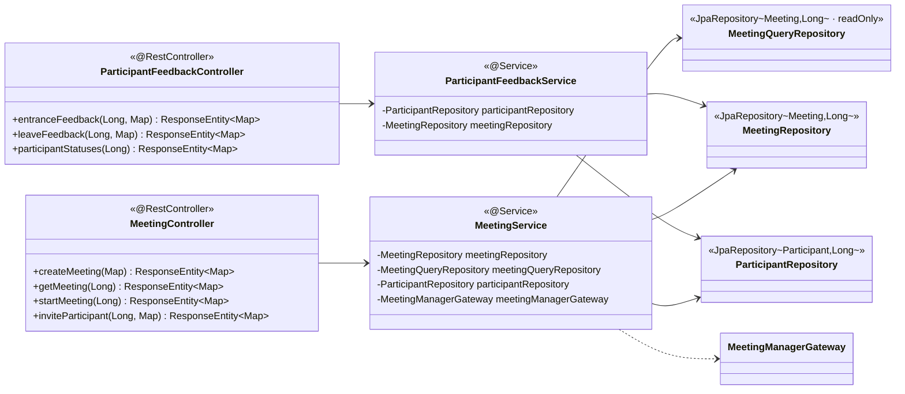

##### 4.2.2.3. domain.meeting 모듈

###### 본 절의 범위

회의 관리 도메인의 클래스 구성·결합을 다룬다. 본 패키지는 회의 생성·시작·조회·초대(`MeetingController`)와 cPaaS 참석자 상태 피드백(`ParticipantFeedbackController`)을 책임진다. 핵심 관심사는 AS-07 CQRS 경로 분리로, 대규모 회의 시작 시점의 write(입장·피드백)와 read(참석자 조회) 경합(ISSUE-07)을 Command/Query Repository로 분리해 완화한다.

###### 구성

| 클래스 | 스테레오타입 | 책임 | 관련 AS |
| ----- | ----- | ----- | :---: |
| `MeetingController` | @RestController | 회의 생성·조회·시작·초대 endpoint | — |
| `ParticipantFeedbackController` | @RestController | 입장 완료·퇴장 피드백·상태 조회 endpoint | AS-07 |
| `MeetingService` | @Service (application) | 회의 흐름, Command/Query 분리 호출 | AS-07·08 |
| `ParticipantFeedbackService` | @Service (application) | 피드백 write·상태 read 분리(ISSUE-07) | AS-07 |
| `MeetingRepository`·`ParticipantRepository` | @Repository (Command) | write, service-pool(Primary) | AS-08 |
| `MeetingQueryRepository` | @Repository (Query, readOnly) | 조회 전용, query-pool(Replica) | AS-07 |
| `Meeting`·`Participant`·`MeetingStatus`·`ParticipantStatus` | entity·enum | 회의·참석자 모델 | — |
| `MeetingManagerGateway` | port | 회의 시작 통보 | AS-09 |

<em>[표 74] domain.meeting 클래스 구성</em>

###### 클래스 다이어그램

<!-- 이미지 파일명(draw.io → PNG 교체 시): report/images/4.2.2-class-meeting.png -->

<em>[그림 55] domain.meeting 클래스 다이어그램</em>

###### 클래스별 상세

- **`MeetingController`**: 회의 생성·조회·시작·초대를 `MeetingService`에 위임. 시작(`startMeeting`)은 `meetingManagerGateway.notifyMeetingStarted()`로 외부 통보를 유발한다.
- **`ParticipantFeedbackController`·`ParticipantFeedbackService`**: cPaaS 피드백(입장 완료·퇴장 write, 상태 조회 read)을 처리한다. write는 `@Transactional`(Primary), 조회는 `@Transactional(readOnly=true)`(Replica)로 분리된다(ISSUE-07 완화).
- **`MeetingService`**: Command는 `MeetingRepository`·`ParticipantRepository`(service-pool), Query는 `MeetingQueryRepository`(query-pool)로 분리 호출한다.

###### 핵심 관심사·AS 결합

| 관심사 | 결합 | AS |
| ----- | ----- | :---: |
| CQRS 경로 분리 | Query Repository → query-pool(Replica), readOnly 라우팅 | AS-07 |
| write 커넥션 격리 | Command Repository → service-pool | AS-08 |
| 외부 장애 차단 | `MeetingManagerGateway` → Adapter CB | AS-09 |

<em>[표 75] domain.meeting 핵심 관심사·AS 결합</em>

###### 타 패키지·외부 의존

`integration.meetingmanager`(port)에 의존. `config`의 serviceDataSource·queryDataSource(AS-07·08), RoutingDataSource·DataSourceRoutingAspect(AS-07 readOnly 라우팅) 결합.
