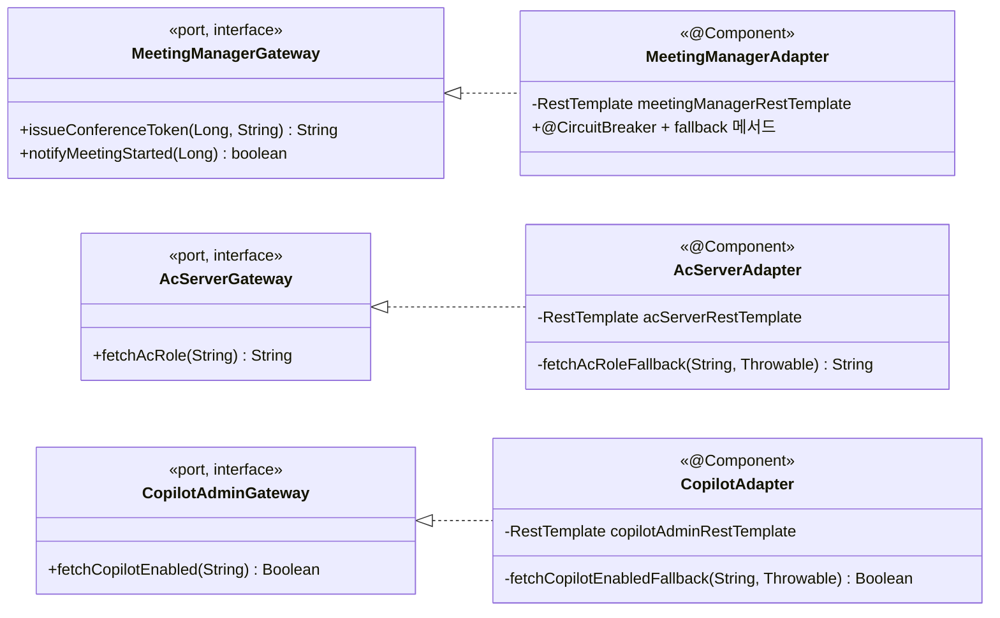

##### 4.2.2.4. integration.* 연계 레이어 (ACL + AS-09)

###### 본 절의 범위

외부 서버 연계를 캡슐화하는 ACL(Anti-Corruption Layer)의 클래스 구성·결합을 다룬다. front-api가 직접 연계하는 외부 서버는 Meeting Manager·AC서버·Copilot Admin 세 개이며, WC·VC 서버는 Meeting Manager 뒤단(cPaaS·server-api)이라 직접 연계 대상이 아니다. 핵심 관심사는 AS-09 서버별 차등 Circuit Breaker와 도메인의 외부 스키마 격리다.

###### 구성

세 연계 패키지가 동일한 `port(Gateway) + adapter(Adapter)` 2클래스 구조를 갖는다. 별도 FeignClient·Fallback 클래스는 없다.

| 패키지 | port | adapter | 대상 서버 |
| ----- | ----- | ----- | ----- |
| `integration.meetingmanager` | `MeetingManagerGateway` | `MeetingManagerAdapter` | Meeting Manager |
| `integration.ac` | `AcServerGateway` | `AcServerAdapter` | AC서버 |
| `integration.copilot` | `CopilotAdminGateway` | `CopilotAdapter` | Copilot Admin |

<em>[표 76] integration.* 패키지 구성</em>

###### 클래스 다이어그램

각 `Adapter`(@Component)는 서버별 `RestTemplate`(`WebClientConfig` 정의)로 외부를 호출하고, 각 메서드에 `@CircuitBreaker`와 내부 fallback 메서드가 붙는다. 도메인은 `Gateway` 인터페이스만 본다.

<!-- 이미지 파일명(draw.io → PNG 교체 시): report/images/4.2.2-class-integration.png -->

<em>[그림 56] integration.* 연계 레이어 클래스 다이어그램</em>

###### 서버별 차등 Circuit Breaker

`@CircuitBreaker(name = ...)` 인스턴스 설정은 `application.yml`의 `resilience4j.circuitbreaker.instances.*`에 서버별로 분리한다.

| 연계 | 메서드 | failureRate | wait | fallback 처리 |
| ----- | ----- | :---: | :---: | ----- |
| `MeetingManagerAdapter` | `issueConferenceToken`·`notifyMeetingStarted` | 50% | 10s | fail-fast (입장 필수) |
| `AcServerAdapter` | `fetchAcRole` | 60% | 30s | null → `AuthService`가 DB Fallback |
| `CopilotAdapter` | `fetchCopilotEnabled` | 70% | 60s | L2 Redis → DB 계층 Fallback |

<em>[표 77] 서버별 차등 Circuit Breaker</em>

###### 타 패키지·외부 의존

`domain.entry`·`domain.meeting`(MeetingManagerGateway), `domain.auth`(AcServerGateway·CopilotAdminGateway)에 의존받으며, `config.WebClientConfig`(RestTemplate)에 의존한다. 도메인에는 역의존하지 않는다.
