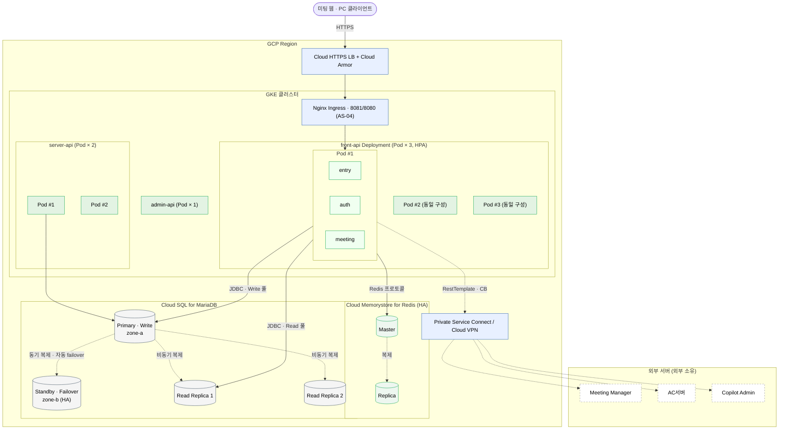
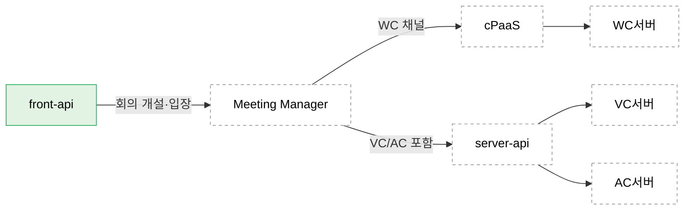

#### 4.2.3. 배치 뷰 (Deployment View)

배치 뷰는 실행 뷰의 런타임 컴포넌트와 모듈 뷰의 빌드 산출물(front-api)이 운영 환경에서 어떤 자원에 할당되는지를 결정한다. 각 인프라 컴포넌트가 어느 AS를 실현하는지, 그리고 공유 인프라의 이중화를 함께 기술한다.

**배치 결정 원칙**

| 원칙 | 근거 | 적용 결과 |
| ----- | ----- | ----- |
| 입장 경로의 물리 분리 | AS-04 · QA-02 | Nginx가 `/join`·`/conference-token`을 8081 Connector로, 그 외를 8080으로 분리 |
| 수평 확장 + 로컬 캐시 | AS-03 · QA-01 | front-api 다중 인스턴스, 각 인스턴스에 L1 Caffeine 로컬 배치. L2 Redis는 공유 |
| 공유 인프라 이중화 | RK-07 · QA-05 | L2 Redis와 MariaDB Replica를 이중화해 단일 장애점 완화 |
| 커넥션 총량 상한 | RK-01 · CR-02 | 기능별 풀 크기 합을 DB 최대 커넥션 이내로 설계, 인스턴스 증가 시 확대 경로 명시 |
| 읽기·쓰기 물리 분리 | AS-07 | Primary는 Write, Replica는 Read 전담. readOnly 트랜잭션으로 라우팅 |

<em>[표 80] 배치 결정 원칙</em>

**종합 배치도**

<!-- 이미지 파일명(draw.io → PNG 교체 시): report/images/4.2-deployment-topology.png -->

<em>[그림 58] 배치 뷰 종합 배치도: GCP Region · GKE(front-api 모듈·server/admin-api) · Cloud SQL/Memorystore 이중화 · PSC 외부 연계 </em>

**GKE 배치·수평 확장**

운영 환경은 GKE(regional·private) 클러스터에 배포하며, 이미지는 GAR에 올리고 ArgoCD가 GitOps로 동기화한다. 역할별 배포 단위를 네임스페이스로 분리한다(`edge` Nginx · `front` front-api · `server` server-api · `admin` admin-api · `observability`).

| 서비스 | 네임스페이스 | Pod(기준) | 수평 확장(HPA) |
| ----- | ----- | :---: | ----- |
| Nginx Ingress | edge | 2 | LB 하위 다중 |
| front-api | front | 3 | CPU 70%/요청률 3→N (트래픽 집중 대상) |
| server-api | server | 2 | CPU 기준 |
| admin-api | admin | 1 | 고정 |

<em>[표 81] GKE Deployment·수평 확장</em>

front-api만 트래픽 집중 대상이라 HPA로 확장한다. L1 Caffeine은 Pod 로컬이라 확장 시 공유되지 않고 L2로 정합을 맞춘다. Pre-warming(AS-05)은 다중 Pod 중복 방지를 위해 리더 선출·분산 락으로 단일 Pod만 수행한다. Pod당 Hikari 풀 합(Primary 200 + Replica 80)이 Pod 수에 비례하므로 Pod 상한과 DB 최대 커넥션(CR-02)을 함께 설계한다(RK-01).

**관측·검증 환경 동등성**

`observability` 네임스페이스에 Prometheus·Grafana를 배치해 풀 사용률·CB 상태·캐시 hit율·응답시간을 수집한다. 운영은 GKE + Cloud SQL(Primary/Replica) + Cloud Memorystore이고, 검증 환경은 동일 구조를 docker-compose(mariadb-primary/replica·redis·nginx·prometheus·grafana·stub-server)로 재현해 메커니즘의 규모 비종속 결과 속성을 확인한다(C-06).

| 항목 | 베이스라인 |
| ----- | ----- |
| 메트릭 수집 주기 | ≤ 15초 |
| 임계 초과 알림 발송 | ≤ 1분 |
| 관측 인프라 가용성 | ≥ 99% |

<em>[표 82] 관측 인프라 베이스라인</em>

**컴포넌트별 설정 요약**

Nginx URL 패턴 라우팅 (AS-04):

| 패턴 | 라우팅 대상 | 비고 |
| ----- | ----- | ----- |
| `/meetings/*/join` | front-api:8081 | 입장 전용 Connector |
| `/meetings/*/conference-token` | front-api:8081 | 입장 전용 Connector |
| 그 외 모든 경로 | front-api:8080 | 일반 Connector |

<em>[표 83] Nginx URL 패턴 라우팅 설정</em>

Tomcat Connector 설정 (AS-04):

| Connector | 포트 | maxThreads | minSpareThreads | 용도 |
| ----- | ----- | ----- | ----- | ----- |
| 입장 전용 | 8081 | 200 | 50 | /join, /conference-token 전용 |
| 일반 | 8080 | 300 | 기본값 | 조회·권한 갱신·관리 |

<em>[표 84] Tomcat Connector 설정</em>

AsyncTaskExecutor 설정 (AS-02):

| Bean | corePoolSize | maxPoolSize | queueCapacity | 용도 |
| ----- | ----- | ----- | ----- | ----- |
| `externalCallExecutor` | 100 | 500 | 2,000 | 외부 서버 호출 전담 |
| `preWarmExecutor` | 10 | 50 | 1,000 | Pre-warming 전담 (저우선순위) |

<em>[표 85] AsyncTaskExecutor 설정</em>

HikariCP 커넥션 풀 구성 (AS-08). 인스턴스당 Primary 커넥션 합은 200(100+40+60), Replica는 80이다. 인스턴스 N대 확장 시 200×N이 DB 최대 커넥션을 넘지 않도록 설계하며, 총량이 상한에 근접하면 확대 대응 경로로 트랜잭션 프록시(ProxySQL/MaxScale)를 도입해 DB 수신 커넥션을 인스턴스 수와 분리한다(RK-01):

| 풀 이름 | 대상 DataSource | maximumPoolSize | connectionTimeout | 용도 |
| ----- | ----- | ----- | ----- | ----- |
| join-pool | joinDataSource (Primary) | 100 | 3,000ms | 입장 처리 전용 |
| service-pool | serviceDataSource (Primary) | 40 | 5,000ms | 회의 시작·초대 |
| general-pool | generalDataSource (Primary) | 60 | 5,000ms | 권한 갱신·일반 조회 |
| query-pool | queryDataSource (Replica) | 80 | 3,000ms | Read 전용 (AS-07 CQRS) |

<em>[표 86] HikariCP 기능별 커넥션 풀 구성</em>

캐시 계층 구성 (AS-03). L2 Redis는 다수 인스턴스가 공유하는 단일 장애점이므로 Sentinel 또는 Cluster로 이중화하고, 장애·miss 시 AS-09 계층 폴백으로 연속성을 유지한다(RK-07):

| 계층 | 구현체 | TTL | 범위 | 이중화 |
| ----- | ----- | ----- | ----- | ----- |
| L1 | Caffeine | 5분 | 인스턴스 로컬 | 인스턴스별 독립 |
| L2 | Redis | AC 1시간 / LLM·용어사전 30분 | 분산 공유 | Sentinel/Cluster HA |

<em>[표 87] 캐시 계층 구성</em>

MariaDB 구성 (AS-07). Replica 장애 시 읽기 경로 영향을 줄이기 위해 다중 Replica를 두고, 강정합 필요 조회는 Primary를 유지한다(RK-07):

| 노드 | 역할 | 라우팅 조건 | 이중화 |
| ----- | ----- | ----- | ----- |
| Primary | Write 전담 | `@Transactional(readOnly=false)` | Replica 승격(failover) 경로 |
| Replica | Read 전담 | `@Transactional(readOnly=true)` | 다중 Replica 배치 |

<em>[표 88] MariaDB Primary/Replica 구성</em>

**외부 연계 경계**

front-api가 직접 연계하는 외부 서버는 Meeting Manager·AC서버·Copilot Admin 세 개다. Meeting Manager는 회의 타입에 따라 뒤단으로 분기하며, front-api의 배치 관심사는 Meeting Manager 경계까지다. WC 채널은 cPaaS를 경유하고, VC·AC 포함 회의는 server-api를 경유해 각 벤더 서버에서 개설된다.

<!-- 이미지 파일명(draw.io → PNG 교체 시): report/images/4.2-deployment-external.png -->

<em>[그림 59] 외부 연계 경계: front-api 직접 연계 3서버와 Meeting Manager 뒤단 계층</em>

AC서버는 두 경로에서 호출된다. front-api의 권한 갱신 직접 호출과, 회의 개설 시 Meeting Manager → server-api를 경유한 AC 회의 개설이다. 배치 뷰의 아웃바운드 경계는 front-api 직접 연계(권한)를 대상으로 한다.

| 컴포넌트 | 배치 | 이중화 | 관련 AS |
| ----- | ----- | ----- | :---: |
| Nginx | front-api 앞단 또는 사이드카 | LB 하위 다중 | AS-04 |
| front-api (Tomcat) | 수평 확장 인스턴스 N대 | LB 분산 | AS-01·02·04 |
| L1 Caffeine | 각 인스턴스 JVM 내 | 인스턴스별 독립 | AS-03 |
| L2 Redis | 공유 캐시 노드 | Sentinel/Cluster HA | AS-03 |
| MariaDB Primary | Write 전담 노드 | Replica 승격 경로 | AS-07 |
| MariaDB Replica | Read 전담 노드 | 다중 Replica | AS-07 |

<em>[표 89] 컴포넌트별 배치·이중화 요약</em>

