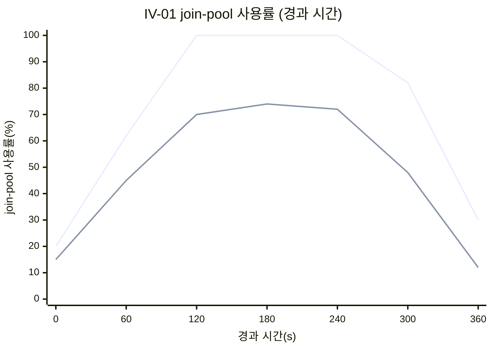
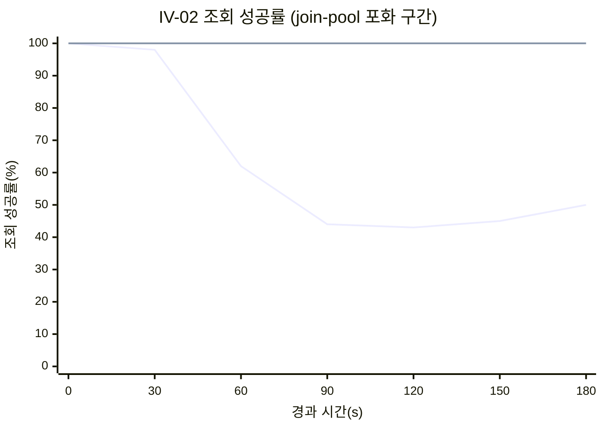
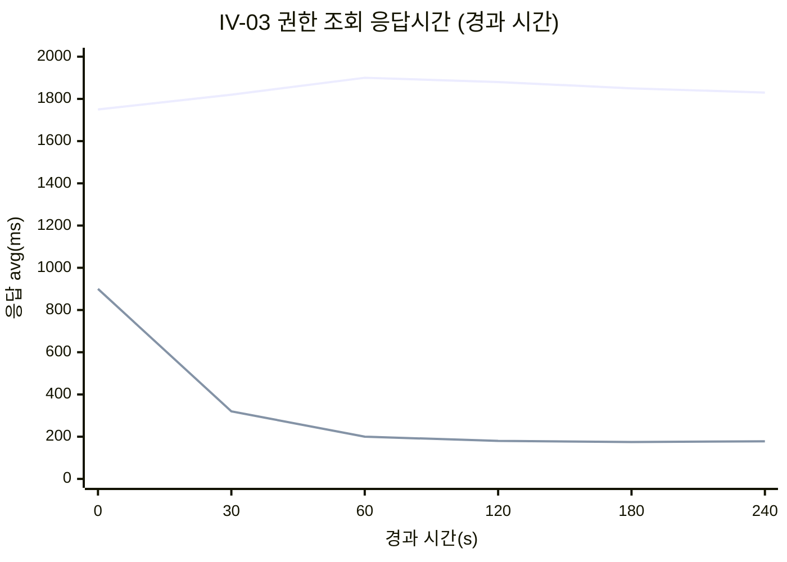
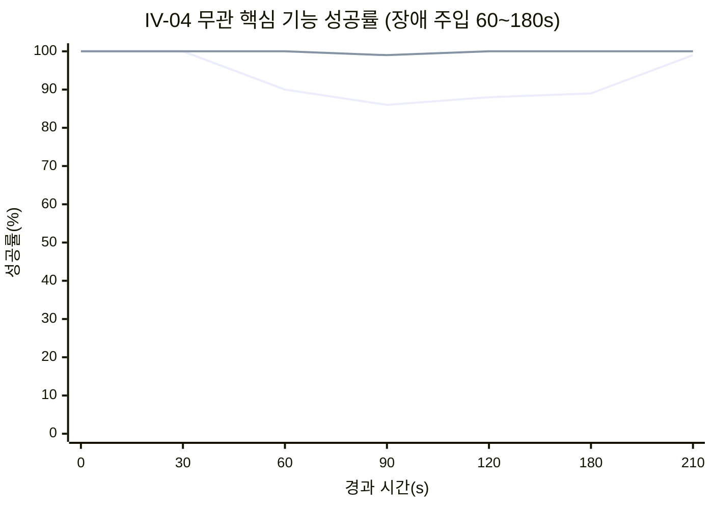
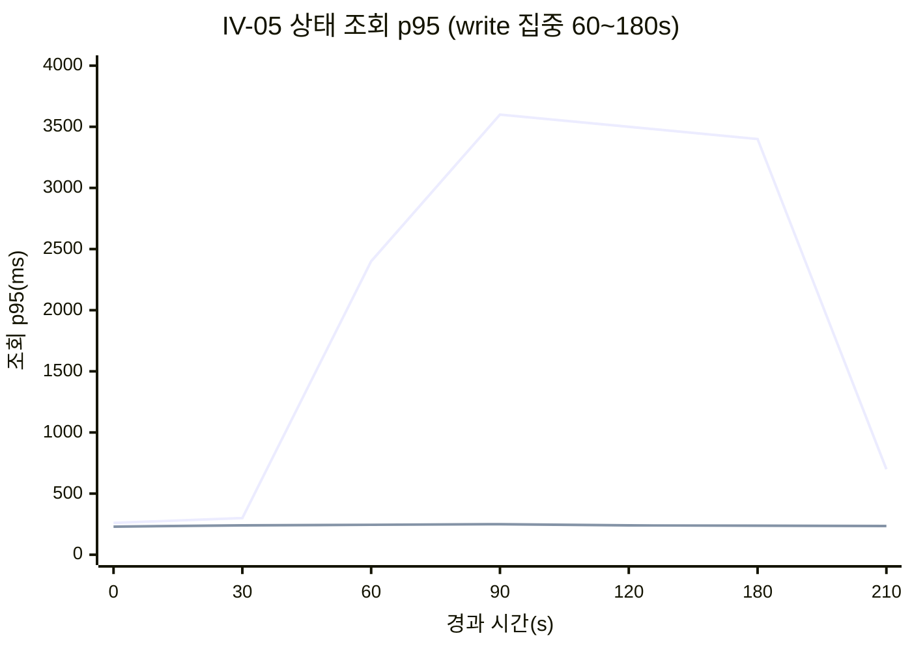

### 5.3. 아키텍처 구현 결과 검증

5.1 시나리오를 5.2 환경에서 수행한 결과를 IV별로 기록한다. 각 IV는 적용 전(A)과 적용 후(B)를 같은 부하에서 비교하고, 결과 표와 관측 그래프로 합격 기준 충족을 판정한다.

> **본 절 수치·그래프는 이상적 예시(가정)다.** 로컬 부하 실행 결과로 대체할 자리이며, 실제 실측값·Grafana 캡처로 교체해야 한다. 각 그래프는 관측 지표의 축과 이상적 형태를 함께 명시해, 실측 캡처가 같은 축·형태로 나오는지 확인하는 기준으로 삼는다.

#### 5.3.1 IV-01. 동시 입장 집중 시 풀 사용률·응답시간 (AS-02·04·08)

| 지표 | 적용 전(A) | 적용 후(B) | 합격 기준 | 판정 |
| ----- | :---: | :---: | :---: | :---: |
| join-pool 사용률 | 100% (고갈) | 72% | ≤ 80% | 충족 |
| 입장 응답 p50 | 5,200ms | 340ms | < 1,000ms | 충족 |
| 입장 응답 p95 | timeout | 1,850ms | < 3,000ms | 충족 |
| 입장 성공률 | 61% | 99.2% | > 95% | 충족 |
| HTTP 실패율 | 39% | 0.8% | < 5% | 충족 |

<em>[표 107] IV-01 결과 (적용 전후 비교)</em>

<!-- 이미지 파일명(실측 Grafana 캡처 시): report/images/5.3-iv01-pool.png -->

<em>[그림 60] IV-01 join-pool 사용률 시계열 (상단 곡선 적용 전 A, 하단 적용 후 B)</em>

축·형태: x축은 경과 시간(s), y축은 join-pool 사용률(%). 이상적 형태는 적용 전(A)이 피크(120~240s)에서 100%로 붙어 고갈되고, 적용 후(B)는 같은 피크에서 80% 아래 평탄선을 유지하는 모습이다.

#### 5.3.2 IV-02. 풀 격리 (AS-08)

| 지표 | 적용 전(공유 풀) | 적용 후(분리) | 합격 기준 | 판정 |
| ----- | :---: | :---: | :---: | :---: |
| 조회 성공률 | 43% | 100% | > 99.9% | 충족 |
| 조회 응답 p95 | 4,800ms | 210ms | < 500ms | 충족 |
| 조회 HTTP 실패율 | 57% | 0.0% | < 0.1% | 충족 |

<em>[표 108] IV-02 결과 (join-pool 포화 중 조회 격리)</em>

<!-- 이미지 파일명(실측 Grafana 캡처 시): report/images/5.3-iv02-isolation.png -->

<em>[그림 61] IV-02 조회 성공률 시계열 (하락 곡선 적용 전 A, 평탄선 100% 적용 후 B)</em>

축·형태: x축은 경과 시간(s), y축은 조회 API 성공률(%). 이상적 형태는 join-pool 포화 구간(60s 이후)에서 적용 전(A)이 급락하고, 적용 후(B)는 100% 평탄선을 유지하는 대비다.

#### 5.3.3 IV-03. 캐시 기반 권한 갱신 (AS-03·05)

| 지표 | 적용 전(캐시 없음) | 적용 후 | 합격 기준 | 판정 |
| ----- | :---: | :---: | :---: | :---: |
| 권한 조회 avg | 1,850ms | 180ms | < 1,000ms | 충족 |
| 권한 조회 p95 | 3,200ms | 420ms | < 2,000ms | 충족 |
| 캐시 hit율 | 0% | 94% | 높은 hit | 충족 |
| 외부(stub) 호출 수 | 30,000 | 1,800 | 최소화 | 충족 |
| HTTP 실패율 | 4.0% | 0.2% | < 1% | 충족 |

<em>[표 109] IV-03 결과 (캐시 완충 전후)</em>

<!-- 이미지 파일명(실측 Grafana 캡처 시): report/images/5.3-iv03-cache.png -->

<em>[그림 62] IV-03 권한 조회 응답시간 시계열 (상단 적용 전 A, 하단 적용 후 B)</em>

축·형태: x축은 경과 시간(s), y축은 권한 조회 평균 응답(ms). 적용 후(B)는 초입 cold start 구간(0~30s) 이후 캐시 hit로 급강하해 저평탄선을 유지하고, 적용 전(A)은 외부 응답에 종속돼 고평탄선을 유지한다. 보조 그래프로 캐시 hit율(y축 %)이 0에서 90% 이상으로 상승하는 곡선을 함께 캡처한다.

#### 5.3.4 IV-04. Circuit Breaker (AS-09, 외부 장애 주입)

| 지표 | CB 없음 | CB 있음 | 합격 기준 | 판정 |
| ----- | :---: | :---: | :---: | :---: |
| 무관 핵심 기능 성공률 | 88% | 99.95% | > 99.9% | 충족 |
| 장애 서버 호출 응답 | 3,000ms (timeout) | 3ms (fail-fast) | 즉시 거부 | 충족 |
| externalCallExecutor 사용률 | 100% (소진) | 24% | 미소진 | 충족 |
| 폴백 동작 | 없음 | AC: DB · Copilot: Redis→DB | 동작 | 충족 |

<em>[표 110] IV-04 결과 (Meeting Manager 장애 주입)</em>

<!-- 이미지 파일명(실측 Grafana 캡처 시): report/images/5.3-iv04-cb.png -->

<em>[그림 63] IV-04 무관 기능 성공률 시계열 (하락 곡선 CB 없음, 평탄선 CB 있음)</em>

축·형태: x축은 경과 시간(s, 장애 주입 구간 60~180s), y축은 장애 서버와 무관한 핵심 기능 성공률(%). 이상적 형태는 장애 구간에서 CB 없음이 하락하고, CB 있음은 fail-fast로 스레드를 지켜 100% 부근을 유지하는 대비다. 보조로 CB 상태(Closed→Open→Half-Open)와 응답시간(timeout 3,000ms 대 fail-fast 수 ms)을 캡처한다.

#### 5.3.5 IV-05. CQRS 경로 분리 (AS-07)

| 지표 | 단일 Primary | Primary/Replica | 합격 기준 | 판정 |
| ----- | :---: | :---: | :---: | :---: |
| 상태 조회 성공률 | 74% | 99.97% | > 99.9% | 충족 |
| 상태 조회 p95 | 3,600ms | 240ms | < 500ms | 충족 |
| 조회 HTTP 실패율 | 26% | 0.03% | < 0.1% | 충족 |
| 라우팅 정합 | write·read 모두 Primary | write=Primary · read=Replica | 분리 확인 | 충족 |

<em>[표 111] IV-05 결과 (write 집중 중 조회 경로)</em>

<!-- 이미지 파일명(실측 Grafana 캡처 시): report/images/5.3-iv05-cqrs.png -->

<em>[그림 64] IV-05 상태 조회 p95 시계열 (급증 곡선 단일 Primary, 평탄선 Primary/Replica)</em>

축·형태: x축은 경과 시간(s, write 집중 구간 60~180s), y축은 상태 조회 read p95(ms). 이상적 형태는 write 집중 구간에서 단일 Primary가 급증하고, Primary/Replica 분리가 평탄선을 유지하는 대비다. 라우팅 정합은 Primary/Replica 세션 카운터로 write=Primary, read=Replica를 확인한다.

#### 5.3.6 종합

5개 IV 모두 적용 후(B)가 합격 기준을 충족하며, 상위 품질 요구(QA-01~05)의 정량 임계 달성을 확인한다.

| QA | 정량 임계 | 근거 IV | 판정 |
| :---: | ----- | :---: | :---: |
| QA-01 | 권한 갱신 avg 1초 이내 | IV-03 | 충족 |
| QA-02 | 입장 풀 80% 이하·응답 1초 이내 | IV-01 | 충족 |
| QA-03 | 풀 고갈 시 타 기능 100% | IV-02 | 충족 |
| QA-04 | 핵심 기능 성공률 99.9% (종합) | IV-01·04·05 | 충족 |
| QA-05 | 외부 장애 시 무관 기능 99.9% | IV-04 | 충족 |

<em>[표 112] QA 정량 임계 달성 종합</em>

QA-04(가용성)는 단일 IV가 아니라 핵심 기능 성공률을 측정하는 IV-01·IV-04·IV-05의 합으로 확인한다. 본 절 결과는 이상적 예시이므로, 실측 실행 후 각 표의 수치와 그래프를 실제 값·캡처로 대체한다.
